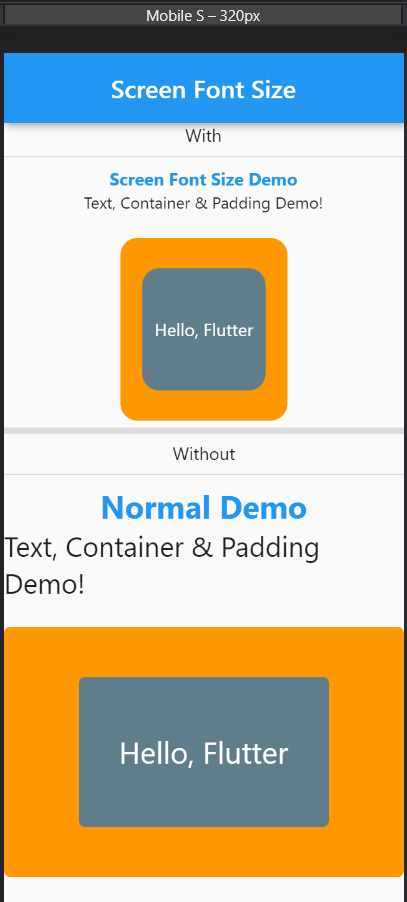
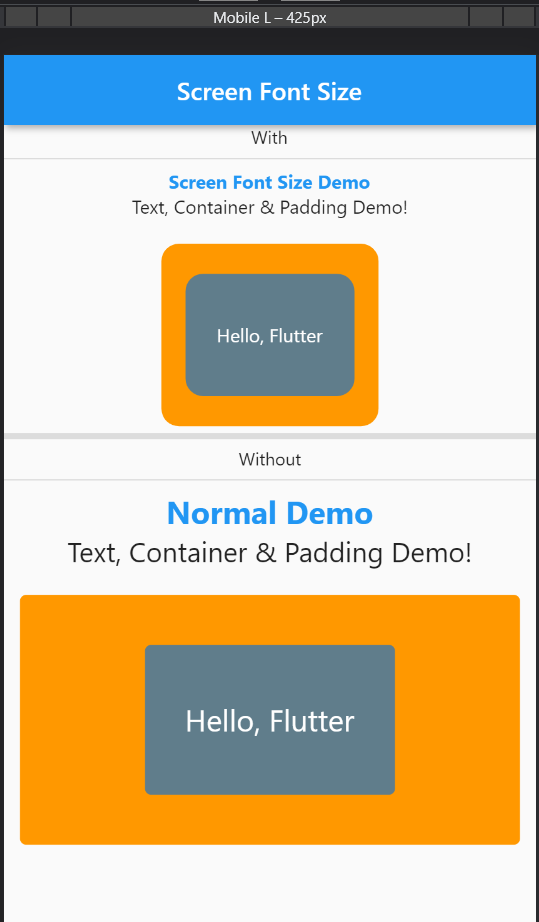
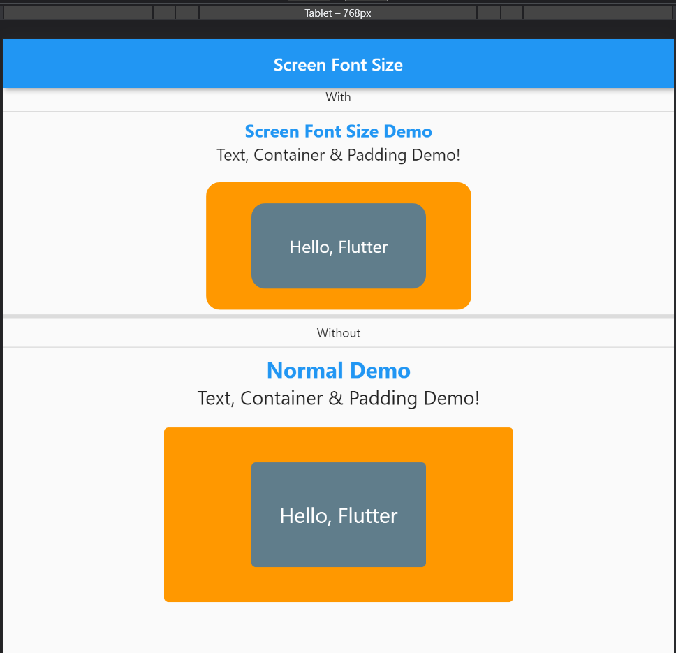
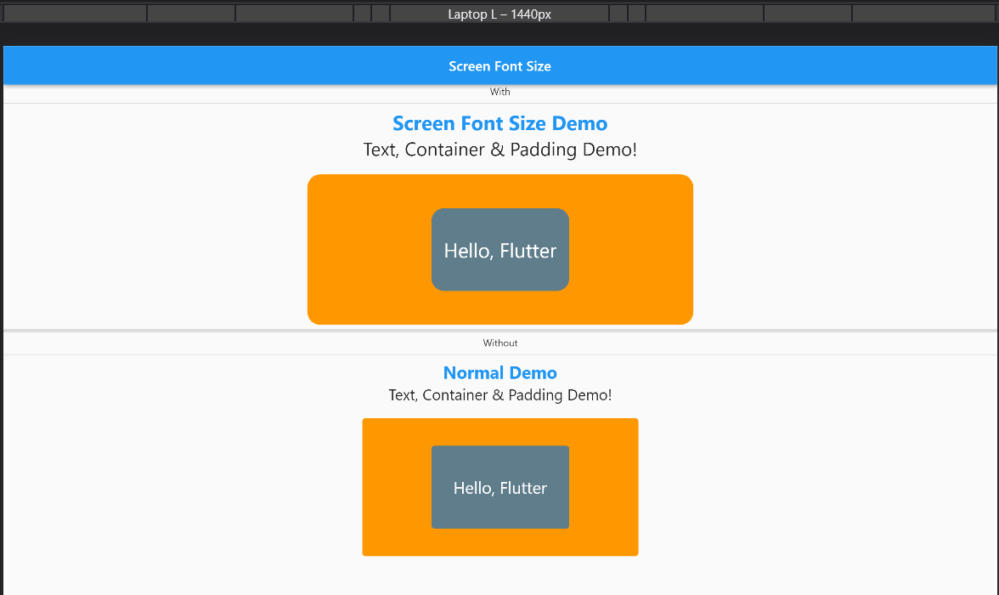

# flutter_sfs (Flutter Screen Font Size)
---
Manage your Text font size, Container height & width, padding, and margin according to device screen size.

## Installing
Add ```flutter_sfs``` to your ```pubspec.yaml``` file:
```dart
dependencies:
  flutter_sfs:
```
Import ```flutter_sfs``` in files that it will be used:
```dart
import 'package:flutter_sfs/flutter_sfs.dart';
```
## Features💚:
* Automatically manage text font size, height, width, padding, and margin according to device screen size.
* You need to fix the screen size(height and width)
* You can decide the maximum and minimum text font size with the range in your project
* You can decide the maximum and minimum horizontal and vertical size with a range in your project to auto-get from the range.

## Getting started
---
* Step 1: Create the object of ```ScreenFontSize``` and add the screen size and maximum & minimum range
```dart
ScreenFontSize sfs = ScreenFontSize(
  context,
  screenSize: ScreenSize(hight: 705, width: 400),
  rangeFontSize: RangeFontSize(min: 10, max: 32),
  rangeHV: RangeHV(min: 12, max: 50),
);
```
* Step 2: Use ```ScreenFontSize``` object (sfs)
1. In Text
```dart
Text(
  "Hello, Flutter",
  style: TextStyle(
    fontSize: sfs.fontsize(24),
    color: Colors.blue,
  ),
),
```
2. In Container
```dart
Container(
    color: Colors.orange,
    height: sfs.vertical(120),
    width: sfs.horizontal(200),
),
```
3. In Padding & Margin
```dart
Padding(
    padding: EdgeInsets.all(sfs.horizontal(8.0)),
    child: 
),
```
```dart
margin: EdgeInsets.symmetric(
        horizontal: sfs.horizontal(18),
        vertical: sfs.vertical(18),
    ),
```

## View
* Mobile
 

* Tablet


* Laptop


---
